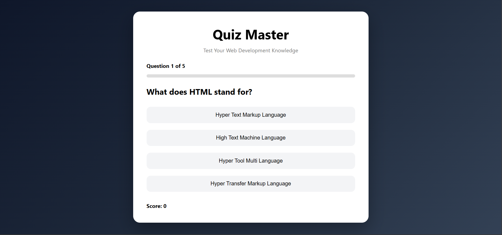

# Quiz Game Application

## SkillCraft Technology Internship Task 3

This project is an interactive Quiz Game Application developed using HTML, CSS, and JavaScript.

## Features

- Multiple Choice Questions
- Score Tracking System
- Progress Bar
- Question Counter
- Correct and Incorrect Answer Highlighting
- Responsive Design
- Final Score Display

## Technologies Used

- HTML
- CSS
- JavaScript

## Project Description

The Quiz Game Application allows users to answer multiple-choice questions and receive instant feedback. The application tracks the user's score, displays progress throughout the quiz, and shows the final result after completion. This project demonstrates JavaScript concepts such as arrays, objects, functions, DOM manipulation, event handling, and conditional logic.

## Learning Outcomes

- DOM Manipulation
- Event Handling
- JavaScript Arrays and Objects
- Dynamic Content Updates
- User Interaction Handling
- Responsive Web Design

## Author

Darshan Naidu

## GitHub Repository

[SkillCraft Web Development Internship - Task 3](https://github.com/DarVoidX/SCT_WD_3)

## Live Demo

You can view the live demo of the application here: [Quiz Master Live Demo](https://darvoidx.github.io/SCT_WD_3/)

## Screenshot

  

## Project Status

Completed